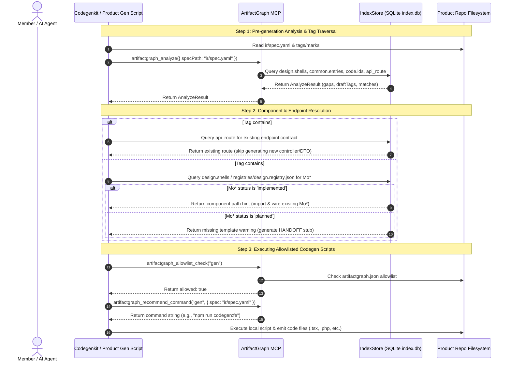

# Sequence Diagram: Codegenkit Code Generation (`/prototype`, `genDry`, `gen`)

```mermaid
sequenceDiagram
    autonumber
    actor Member as Member / AI Agent
    participant Codegen as Codegenkit / Product Gen Script
    participant AG_MCP as ArtifactGraph MCP
    participant SQLite as IndexStore (SQLite index.db)
    participant FS as Product Repo Filesystem

    Note over Codegen, FS: Step 1: Pre-generation Analysis & Tag Traversal
    Codegen->>FS: Read ir/spec.yaml & tags/marks
    Codegen->>AG_MCP: artifactgraph_analyze({ specPath: "ir/spec.yaml" })
    AG_MCP->>SQLite: Query design.shells, common.entries, code.ids, api_route
    SQLite-->>AG_MCP: Return AnalyzeResult (gaps, draftTags, matches)
    AG_MCP-->>Codegen: Return AnalyzeResult

    Note over Codegen, FS: Step 2: Component & Endpoint Resolution
    alt Tag contains #reuse-api
        Codegen->>SQLite: Query api_route for existing endpoint contract
        SQLite-->>Codegen: Return existing route (skip generating new controller/DTO)
    else Tag contains #needs-component (Mo*)
        Codegen->>SQLite: Query design.shells / registries/design.registry.json for Mo*
        alt Mo* status is 'implemented'
            SQLite-->>Codegen: Return component path hint (import & wire existing Mo*)
        else Mo* status is 'planned'
            SQLite-->>Codegen: Return missing template warning (generate HANDOFF stub)
        end
    end

    Note over Codegen, FS: Step 3: Executing Allowlisted Codegen Scripts
    Codegen->>AG_MCP: artifactgraph_allowlist_check("gen")
    AG_MCP->>FS: Check artifactgraph.json allowlist
    AG_MCP-->>Codegen: Return allowed: true
    Codegen->>AG_MCP: artifactgraph_recommend_command("gen", { spec: "ir/spec.yaml" })
    AG_MCP-->>Codegen: Return command string (e.g., "npm run codegen:fe")
    Codegen->>FS: Execute local script & emit code files (.tsx, .php, etc.)
```
