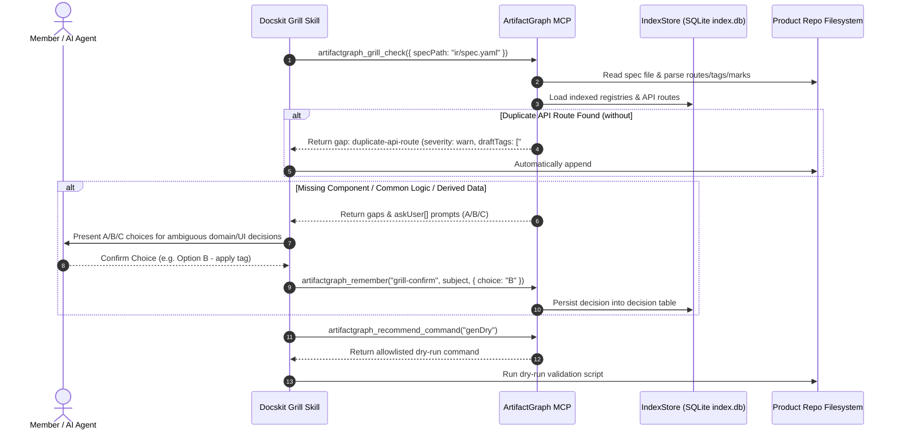

# Sequence Diagram: Docskit Grill Phase (`/dev-grill-docs`, `/bqa-grill-docs`, `/grill-with-docs`)

```mermaid
sequenceDiagram
    autonumber
    actor Member as Member / AI Agent
    participant Grill as Docskit Grill Skill
    participant AG_MCP as ArtifactGraph MCP
    participant SQLite as IndexStore (SQLite index.db)
    participant FS as Product Repo Filesystem

    Grill->>AG_MCP: artifactgraph_grill_check({ specPath: "ir/spec.yaml" })
    AG_MCP->>FS: Read spec file & parse routes/tags/marks
    AG_MCP->>SQLite: Load indexed registries & API routes
    
    alt Duplicate API Route Found (without #reuse-api)
        AG_MCP-->>Grill: Return gap: duplicate-api-route (severity: warn, draftTags: ["#reuse-api"])
        Grill->>FS: Automatically append #reuse-api tag to spec tags
    end

    alt Missing Component / Common Logic / Derived Data
        AG_MCP-->>Grill: Return gaps & askUser[] prompts (A/B/C)
        Grill->>Member: Present A/B/C choices for ambiguous domain/UI decisions
        Member-->>Grill: Confirm Choice (e.g. Option B - apply tag)
        Grill->>AG_MCP: artifactgraph_remember("grill-confirm", subject, { choice: "B" })
        AG_MCP->>SQLite: Persist decision into decision table
    end

    Grill->>AG_MCP: artifactgraph_recommend_command("genDry")
    AG_MCP-->>Grill: Return allowlisted dry-run command
    Grill->>FS: Run dry-run validation script
```
