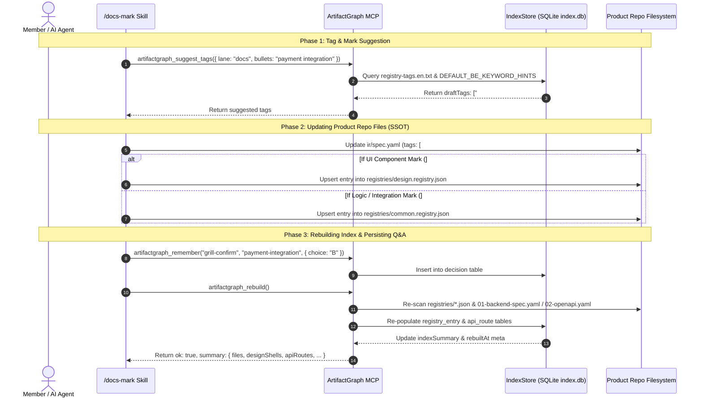

# Sequence Diagram: `/docs-mark` Skill Workflow

```mermaid
sequenceDiagram
    autonumber
    actor Member as Member / AI Agent
    participant MarkSkill as /docs-mark Skill
    participant AG_MCP as ArtifactGraph MCP
    participant SQLite as IndexStore (SQLite index.db)
    participant FS as Product Repo Filesystem

    Note over Member, FS: Phase 1: Tag & Mark Suggestion
    MarkSkill->>AG_MCP: artifactgraph_suggest_tags({ lane: "docs", bullets: "payment integration" })
    AG_MCP->>SQLite: Query registry-tags.en.txt & DEFAULT_BE_KEYWORD_HINTS
    SQLite-->>AG_MCP: Return draftTags: ["#call-external", "#reuse-api"]
    AG_MCP-->>MarkSkill: Return suggested tags

    Note over Member, FS: Phase 2: Updating Product Repo Files (SSOT)
    MarkSkill->>FS: Update ir/spec.yaml (tags: [#call-external] or technicalMarks[])
    
    alt If UI Component Mark (#needs-component / Mo*)
        MarkSkill->>FS: Upsert entry into registries/design.registry.json
    else If Logic / Integration Mark (#common / #call-external / #cross-service)
        MarkSkill->>FS: Upsert entry into registries/common.registry.json
    end

    Note over Member, FS: Phase 3: Rebuilding Index & Persisting Q&A
    MarkSkill->>AG_MCP: artifactgraph_remember("grill-confirm", "payment-integration", { choice: "B" })
    AG_MCP->>SQLite: Insert into decision table
    MarkSkill->>AG_MCP: artifactgraph_rebuild()
    AG_MCP->>FS: Re-scan registries/*.json & 01-backend-spec.yaml / 02-openapi.yaml
    AG_MCP->>SQLite: Re-populate registry_entry & api_route tables
    SQLite-->>AG_MCP: Update indexSummary & rebuiltAt meta
    AG_MCP-->>MarkSkill: Return ok: true, summary: { files, designShells, apiRoutes, ... }
```
