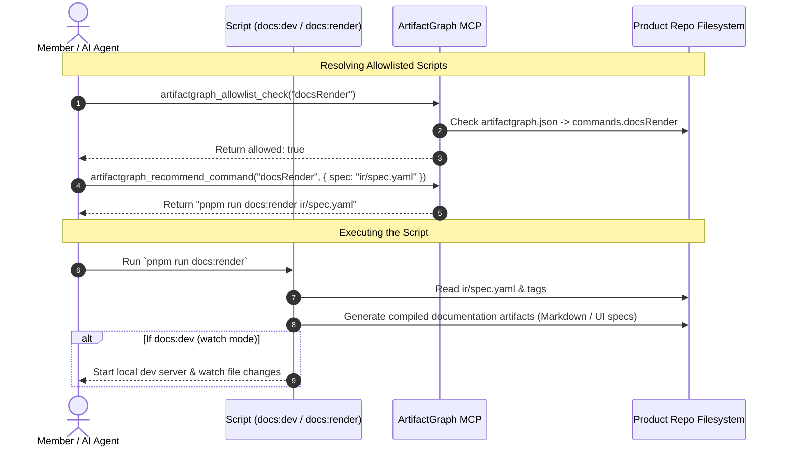

# Sequence Diagram: Scripts `docs:dev` & `docs:render`

```mermaid
sequenceDiagram
    autonumber
    actor Member as Member / AI Agent
    participant Script as Script (docs:dev / docs:render)
    participant AG_MCP as ArtifactGraph MCP
    participant FS as Product Repo Filesystem

    Note over Member, FS: Resolving Allowlisted Scripts
    Member->>AG_MCP: artifactgraph_allowlist_check("docsRender")
    AG_MCP->>FS: Check artifactgraph.json -> commands.docsRender
    AG_MCP-->>Member: Return allowed: true
    
    Member->>AG_MCP: artifactgraph_recommend_command("docsRender", { spec: "ir/spec.yaml" })
    AG_MCP-->>Member: Return "pnpm run docs:render ir/spec.yaml"
    
    Note over Member, FS: Executing the Script
    Member->>Script: Run `pnpm run docs:render`
    Script->>FS: Read ir/spec.yaml & tags
    Script->>FS: Generate compiled documentation artifacts (Markdown / UI specs)
    
    alt If docs:dev (watch mode)
        Script-->>Member: Start local dev server & watch file changes
    end
```
