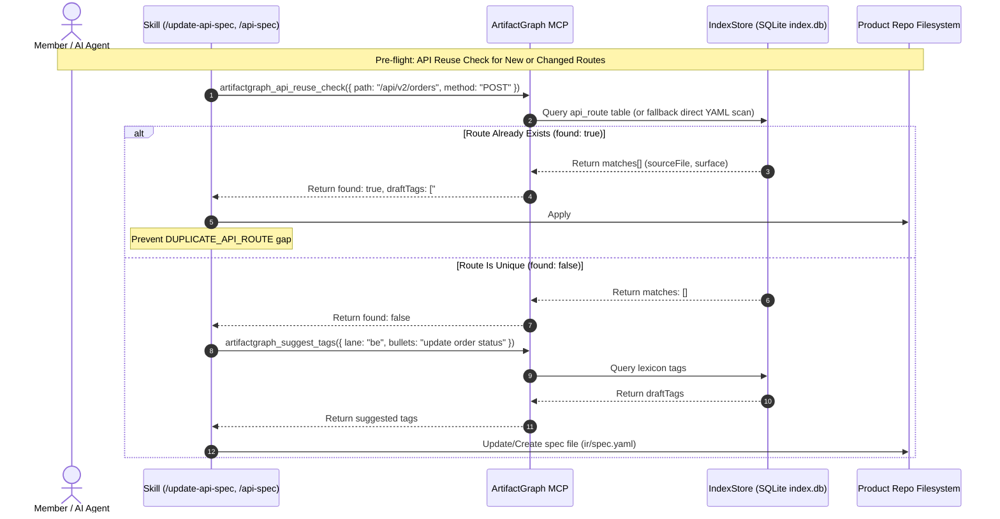

# Sequence Diagram: Skill `/update-api-spec` & `/api-spec`

```mermaid
sequenceDiagram
    autonumber
    actor Member as Member / AI Agent
    participant UpdateSkill as Skill (/update-api-spec, /api-spec)
    participant AG_MCP as ArtifactGraph MCP
    participant SQLite as IndexStore (SQLite index.db)
    participant FS as Product Repo Filesystem

    Note over Member, FS: Pre-flight: API Reuse Check for New or Changed Routes
    UpdateSkill->>AG_MCP: artifactgraph_api_reuse_check({ path: "/api/v2/orders", method: "POST" })
    AG_MCP->>SQLite: Query api_route table (or fallback direct YAML scan)
    
    alt Route Already Exists (found: true)
        SQLite-->>AG_MCP: Return matches[] (sourceFile, surface)
        AG_MCP-->>UpdateSkill: Return found: true, draftTags: ["#reuse-api"]
        UpdateSkill->>FS: Apply #reuse-api to current spec
        Note over UpdateSkill: Prevent DUPLICATE_API_ROUTE gap
    else Route Is Unique (found: false)
        SQLite-->>AG_MCP: Return matches: []
        AG_MCP-->>UpdateSkill: Return found: false
        UpdateSkill->>AG_MCP: artifactgraph_suggest_tags({ lane: "be", bullets: "update order status" })
        AG_MCP->>SQLite: Query lexicon tags
        SQLite-->>AG_MCP: Return draftTags
        AG_MCP-->>UpdateSkill: Return suggested tags
        UpdateSkill->>FS: Update/Create spec file (ir/spec.yaml)
    end
```
