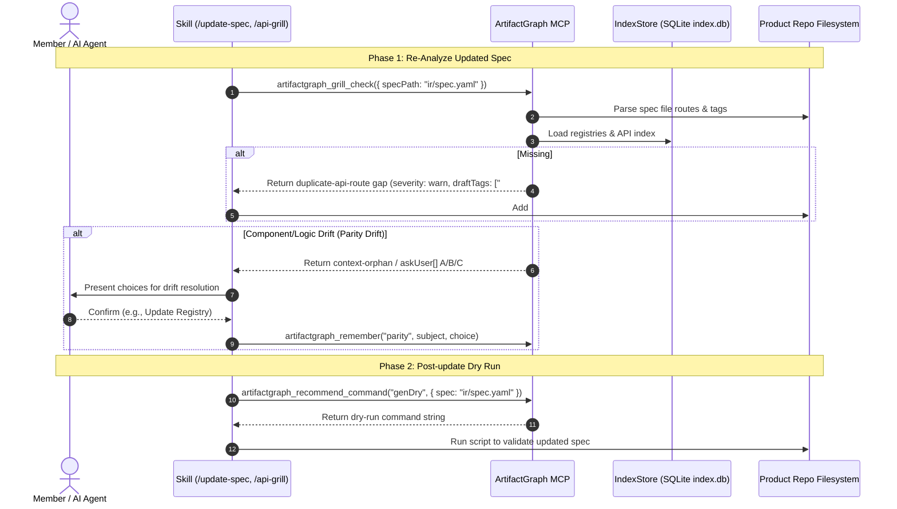

# Sequence Diagram: Skill `/update-spec` & `/api-grill`

```mermaid
sequenceDiagram
    autonumber
    actor Member as Member / AI Agent
    participant GrillSkill as Skill (/update-spec, /api-grill)
    participant AG_MCP as ArtifactGraph MCP
    participant SQLite as IndexStore (SQLite index.db)
    participant FS as Product Repo Filesystem

    Note over Member, FS: Phase 1: Re-Analyze Updated Spec
    GrillSkill->>AG_MCP: artifactgraph_grill_check({ specPath: "ir/spec.yaml" })
    AG_MCP->>FS: Parse spec file routes & tags
    AG_MCP->>SQLite: Load registries & API index
    
    alt Missing #reuse-api Tag on Existing Route
        AG_MCP-->>GrillSkill: Return duplicate-api-route gap (severity: warn, draftTags: ["#reuse-api"])
        GrillSkill->>FS: Add #reuse-api tag
    end

    alt Component/Logic Drift (Parity Drift)
        AG_MCP-->>GrillSkill: Return context-orphan / askUser[] A/B/C
        GrillSkill->>Member: Present choices for drift resolution
        Member-->>GrillSkill: Confirm (e.g., Update Registry)
        GrillSkill->>AG_MCP: artifactgraph_remember("parity", subject, choice)
    end

    Note over Member, FS: Phase 2: Post-update Dry Run
    GrillSkill->>AG_MCP: artifactgraph_recommend_command("genDry", { spec: "ir/spec.yaml" })
    AG_MCP-->>GrillSkill: Return dry-run command string
    GrillSkill->>FS: Run script to validate updated spec
```
