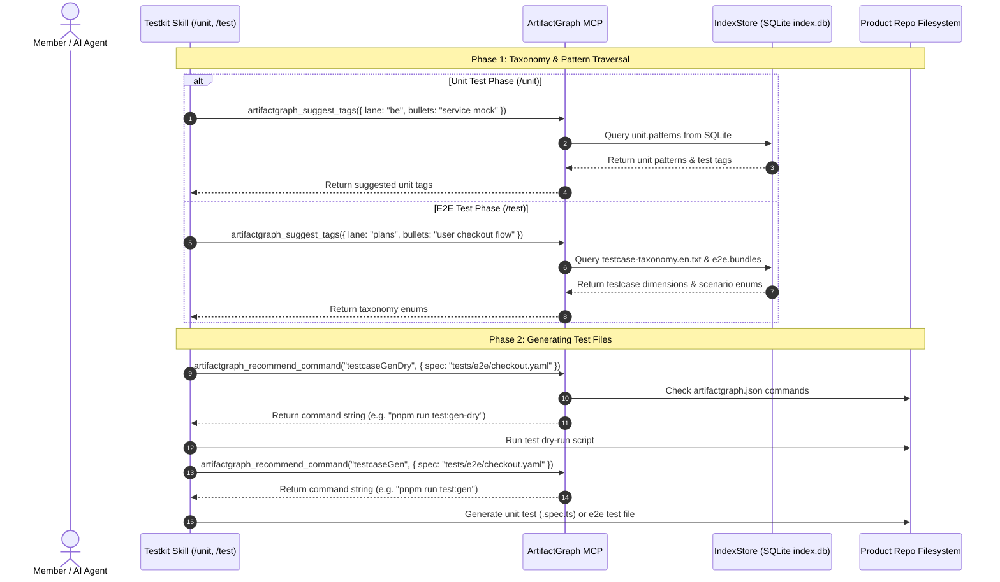

# Sequence Diagram: Testkit Testing Phase (`/unit`, `/test`)

```mermaid
sequenceDiagram
    autonumber
    actor Member as Member / AI Agent
    participant Testkit as Testkit Skill (/unit, /test)
    participant AG_MCP as ArtifactGraph MCP
    participant SQLite as IndexStore (SQLite index.db)
    participant FS as Product Repo Filesystem

    Note over Testkit, FS: Phase 1: Taxonomy & Pattern Traversal
    alt Unit Test Phase (/unit)
        Testkit->>AG_MCP: artifactgraph_suggest_tags({ lane: "be", bullets: "service mock" })
        AG_MCP->>SQLite: Query unit.patterns from SQLite
        SQLite-->>AG_MCP: Return unit patterns & test tags
        AG_MCP-->>Testkit: Return suggested unit tags
    else E2E Test Phase (/test)
        Testkit->>AG_MCP: artifactgraph_suggest_tags({ lane: "plans", bullets: "user checkout flow" })
        AG_MCP->>SQLite: Query testcase-taxonomy.en.txt & e2e.bundles
        SQLite-->>AG_MCP: Return testcase dimensions & scenario enums
        AG_MCP-->>Testkit: Return taxonomy enums
    end

    Note over Testkit, FS: Phase 2: Generating Test Files
    Testkit->>AG_MCP: artifactgraph_recommend_command("testcaseGenDry", { spec: "tests/e2e/checkout.yaml" })
    AG_MCP->>FS: Check artifactgraph.json commands
    AG_MCP-->>Testkit: Return command string (e.g. "pnpm run test:gen-dry")
    Testkit->>FS: Run test dry-run script
    
    Testkit->>AG_MCP: artifactgraph_recommend_command("testcaseGen", { spec: "tests/e2e/checkout.yaml" })
    AG_MCP-->>Testkit: Return command string (e.g. "pnpm run test:gen")
    Testkit->>FS: Generate unit test (.spec.ts) or e2e test file
```
